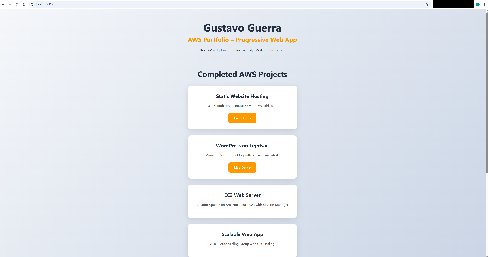
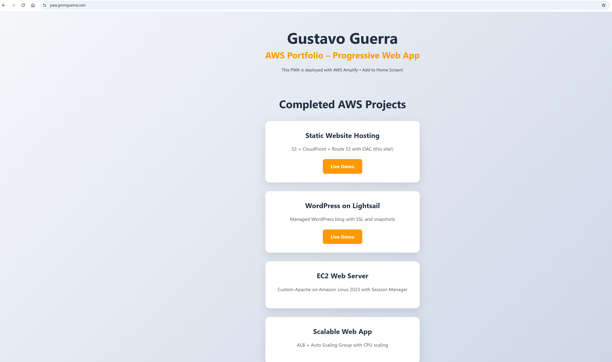

# Project 7 – Progressive Web App (PWA) Hosting with AWS Amplify

## Overview
Deployed a modern Progressive Web App using AWS Amplify for full-stack serverless frontend hosting. The app is built with React + Vite and includes PWA features like offline support, installable "Add to Home Screen", and service worker caching.

This project demonstrates how to go from local development to global deployment with automatic CI/CD, custom domain, and HTTPS — all with zero server management.

**Key AWS Services Used**
- **AWS Amplify** – CI/CD, hosting, global CDN, custom domain
- **Amazon CloudFront** – Global edge caching (powered by Amplify)
- **Amazon Certificate Manager (ACM)** – Free SSL certificate
- **Route 53** – Custom domain routing

**Live Demo**  
https://pwa.gmmguerra.com

## Features Implemented
- Offline functionality (service worker caches assets)
- Installable on mobile and desktop ("Add to Home Screen")
- Fast loading via global CDN
- Automatic builds and deploys on every Git push
- HTTPS with custom domain
- Responsive design

## Screenshots

  
*Production build working offline*

  
*Successful build and deployment log*

  
*Final site live with HTTPS and PWA features*

## Architecture & Improvements
- Used Vite + React (2025 standard) instead of outdated Create React App
- Deployed from subfolder in main portfolio repo via Amplify app root setting
- Full PWA capabilities with `vite-plugin-pwa`
- Zero ongoing cost (Amplify free tier covers demo traffic)

This project shows modern frontend deployment workflow — from local dev to global serverless hosting with CI/CD.

Built December 2025.
